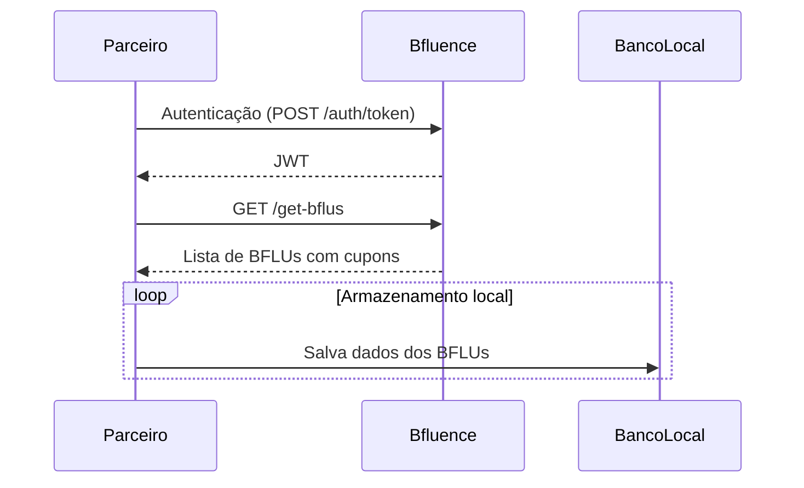

### Fluxo: Sincronização de BFLUs

Este fluxo descreve o processo de consulta e armazenamento local dos influenciadores disponíveis na sua comunidade.

---

### Diagrama de sequência

---

### Etapas

1. **Autenticação**: o parceiro solicita o token via `POST /auth/token`
2. **Consulta**: utiliza o JWT para consultar o endpoint `GET /get-bflus`
3. **Armazenamento local**: os dados são sincronizados no banco da comunidade
4. **Endpoint**: > [GET /get-bflus → Consulta de BFLUs](../endpoints/get-bflus.md)

> Este fluxo pode ser repetido periodicamente para manter os dados atualizados.

---

> A seguir: [Fluxo de Transações](./fluxo-transacoes.md)
