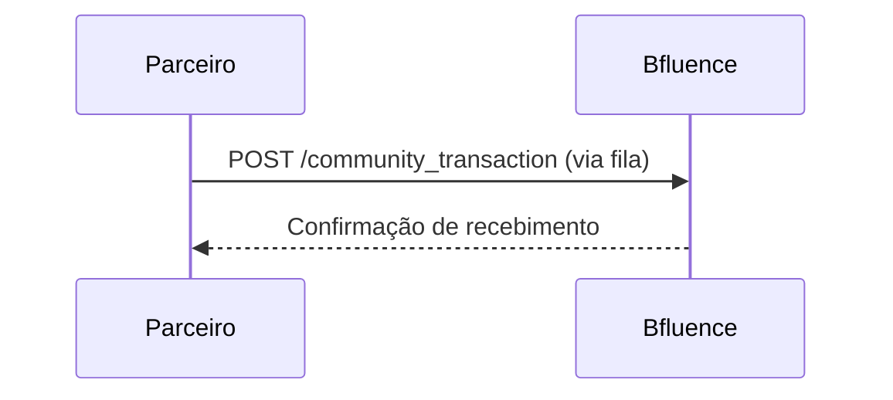

### Fluxo: Envio de Transações

Este fluxo descreve o envio de transações comissionadas (já calculadas) da comunidade para a Bfluence.

---

### Diagrama de sequência

---

### Etapas

1. A comunidade identifica que uma venda foi realizada com um cupom de BFLU
2. Calcula o valor da comissão
3. Envia os dados via `POST /community_transaction`
4. A Bfluence valida e persiste os dados
5. **Endpoint**: > [GET /get-bflus → Consulta de BFLUs](../endpoints/post-community-transaction.md)

---

### Requisitos

- Token JWT válido no header
- Payload no formato JSON conforme [modelo de transação](../modelos/transacao.md)

> As transações são processadas de forma assíncrona. Recomenda-se controle de retries ou filas locais no parceiro.
