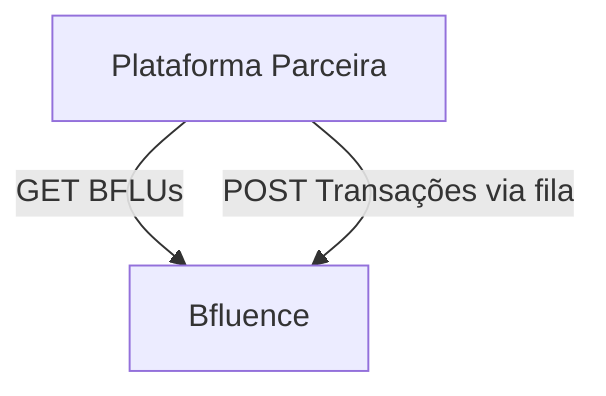

# 👋 Integração de Comunidades com a Plataforma Bfluence

Bem-vindo à documentação técnica da **API Pública da Bfluence**, desenvolvida para facilitar a **integração de comunidades, marketplaces e ecossistemas parceiros** com a nossa plataforma de influenciadores.

Esta integração permite:

✅ Consulta de influenciadores (BFLUs) ativos  
✅ Rastreamento de cupons exclusivos  
✅ Envio automatizado de transações comissionadas  
✅ Comunicação segura via JWT e fila

---

## 🎯 Objetivo

Permitir que **sistemas de terceiros** (como e-commerces, plataformas de cursos, clubes de assinatura, apps de fidelidade) integrem-se com a Bfluence para:

- Atribuir cupons por influenciador
- Rastrear transações de venda
- Registrar comissões por performance
- Automatizar o repasse de dados e relatórios

---

## 🔐 Autenticação

A autenticação é baseada em **Bearer Token (JWT)**, enviado via header HTTP padrão:

```http
Authorization: Bearer <seu_token>
```

Além disso, alguns endpoints exigem:

| Header         | Tipo    | Descrição                         |
|----------------|---------|------------------------------------|
| `client_id`    | string  | Identificador da comunidade        |
| `client_secret`| string  | Chave secreta da comunidade        |

Tokens são emitidos pela equipe da Bfluence durante o processo de homologação.

---

## 🔄 Fluxo da Integração



### Passos:

1. A comunidade solicita os dados dos BFLUs através do endpoint GET  
2. Registra os influenciadores localmente  
3. A cada venda com cupom, envia uma transação via fila para a Bfluence

---

## 📥 Endpoint: GET /get-bflus

Retorna a lista de BFLUs disponíveis para a comunidade.

**URL de exemplo:**

```
GET /communities/hub/client/{client_id}/get-bflus?page=1&page_size=10
```

### Headers obrigatórios:

- `Authorization: Bearer <token>`

### Parâmetros:

| Nome        | Tipo    | Local | Obrigatório | Descrição                          |
|-------------|---------|-------|-------------|-------------------------------------|
| `client_id` | string  | path  | Sim         | ID da comunidade integradora        |
| `page`      | number  | query | Não         | Página                              |
| `page_size` | number  | query | Não         | Tamanho da página                   |

### Exemplo de resposta:

```json
[
  {
    "community_bflu_id": "0001",
    "community_bflu_cpf": "00000000000",
    "community_bflu_coupon": "GLAM123",
    "community_client_bflu_status": "active",
    "community_client_response_status": "approved",
    "community_client_rejection_reason": null,
    "update_date": "2025-05-01T12:00:00Z"
  }
]
```

---

## 💸 Endpoint: POST /community_transaction

A comunidade envia uma transação comissionada já calculada.

**URL de exemplo:**

```
POST /communities/hub/client/{client_id}/community_transaction
```

### Headers obrigatórios:

- `Authorization: Bearer <token>`
- `client_id: string`
- `client_secret: string`

### Payload:

```json
{
  "community_bflu_id": "0001",
  "description": "Venda do produto XYZ",
  "total_amount": 45.50,
  "sold_value": 150.00,
  "coupon_name": "GLAM123",
  "date_created": "2025-05-01T10:00:00Z",
  "date_updated": "2025-05-01T10:01:00Z"
}
```

### Resposta esperada:

```json
{
  "status": "success",
  "message": "Transação registrada com sucesso"
}
```

---

## 🧾 Modelos de Dados

### 📦 Objeto BFLU

| Campo                            | Tipo     | Descrição                                     |
|----------------------------------|----------|-----------------------------------------------|
| `community_bflu_id`              | string   | ID do influenciador na comunidade             |
| `community_bflu_cpf`             | string   | CPF do influenciador                          |
| `community_bflu_coupon`          | string   | Cupom promocional associado                   |
| `community_client_bflu_status`   | string   | Status da bflu no cliente                     |
| `community_client_response_status` | string | Status do processamento pelo cliente          |
| `community_client_rejection_reason` | string | Motivo da rejeição (se houver)               |
| `update_date`                    | ISODate  | Última atualização                            |

### 📦 Objeto Transação

| Campo           | Tipo     | Obrigatório | Descrição                                   |
|------------------|----------|-------------|----------------------------------------------|
| `client_id`      | Header   | Sim         | Identificação da comunidade                  |
| `client_secret`  | Header   | Sim         | Chave de autenticação da comunidade          |
| `community_bflu_id` | string| Sim         | ID do BFLU relacionado                       |
| `description`    | string   | Sim         | Descrição da transação                       |
| `total_amount`   | decimal  | Sim         | Valor da comissão calculado pela comunidade |
| `sold_value`     | decimal  | Não         | Valor total da venda                         |
| `coupon_name`    | string   | Sim         | Cupom utilizado na venda                     |
| `date_created`   | ISODate  | Sim         | Data da transação                            |
| `date_updated`   | ISODate  | Sim         | Última atualização                           |

---

## 🧭 Responsabilidades

### 🎯 Bfluence

- Expor o endpoint de consulta de BFLUs  
- Receber transações comissionadas via fila  
- Validar estrutura, consistência e integridade dos dados  
- Auditar transações (opcional)

### 🎯 Comunidade Parceira

- Consultar e armazenar os BFLUs localmente  
- Atribuir cupons e rastrear vendas  
- Calcular as comissões  
- Enviar transações conforme especificações

---

## 📌 Requisitos Técnicos

| Item                        | Valor                              |
|-----------------------------|-------------------------------------|
| Autenticação                | JWT (Bearer Token) com assinatura HMAC |
| Formato de payload          | JSON (XML sob demanda)             |
| Transporte                  | HTTPS com autenticação no header   |
| Compatibilidade             | Backend customizados suportados    |
| SLA de análise              | 1–2 dias úteis                     |
| SLA de integração completa  | 5–10 dias úteis após homologação   |

---

> Para dar continuidade à integração, entre em contato com a equipe Bfluence.
